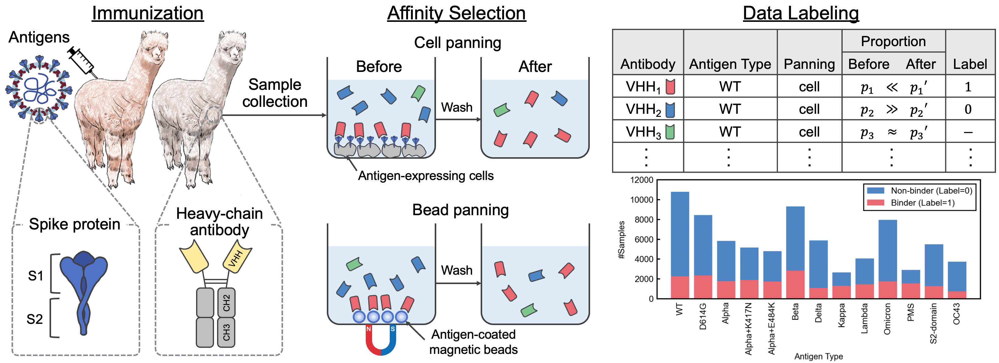

# A SARS-CoV-2 Interaction Dataset and VHH Sequence Corpus for Antibody Language Models

This repository contains the supplementary material accompanying the paper, A SARS-CoV-2 Interaction Dataset and VHH Sequence Corpus for Antibody Language Models.

The datasets are available at https://datasets.cognanous.com under a CC BY-NC 4.0 license.



<div style="text-align: center;">
Overview of the data generation process.
</div>

## Table of Contents

- [Environment](#environment)
- [Dataset](#dataset)
  - [Links](#links)
  - [Data Processing](#data-processing)
- [Benchmarks](#benchmarks)
  - [Pre-training](#pre-training)
  - [Fine-tuning](#fine-tuning)
- [Citation](#citation)

## Environment

To get started, clone this repository and run the following command to create a virtual environment.

```bash
python3 -m venv ./venv
source ./venv/bin/activate
pip install -r requirements.txt
```

## Dataset

### Links

| Dataset          |                                 Link                                                 |
|------------------|:------------------------------------------------------------------------------------:|
| VHHCorpus-2M     | [Link to Hugging Face Hub](https://huggingface.co/datasets/COGNANO/VHHCorpus-2M)     |
| AVIDa-SARS-CoV-2 | [Link to Hugging Face Hub](https://huggingface.co/datasets/COGNANO/AVIDa-SARS-CoV-2) |

### Data Processing

First, you need to create a Docker image.

```bash
docker build -t vhh_constructor:latest ./dataset/vhh_constructor
```

After placing the [FASTQ files](https://drive.google.com/drive/folders/151Njm6OE9G5m8vyzDcn8w8mWye8ULsYU?usp=sharing) under `dataset/raw/fastq`, execute the following command to output a labeled CSV file.

```bash
bash ./dataset/preprocess.sh
```

## Benchmarks

### Pre-training

```bash
python benchmarks/pretrain.py --vocab-file "benchmarks/data/vocab_vhhbert.txt" \
  --epochs 20 \
  --batch-size 128 \
  --save-dir "outputs"
```

**Arguments:**

| Argument      | Required | Default   | Description                      |
|---------------|----------|-----------|----------------------------------|
| --vocab-file  | Yes      |           | Path of the vocabulary file      |
| --epochs      | No       | 20        | Number of epochs                 |
| --batch-size  | No       | 128       | Size of mini-batch               |
| --seed        | No       | 123       | Random seed                      |
| --save-dir    | No       | ./saved   | Path of the save directory       |

### Fine-tuning

```bash
python benchmarks/finetune.py --palm-type "VHHBERT" \
  --epochs 30 \
  --batch-size 32 \
  --save-dir "outputs"
```

**Arguments:**

| Argument          | Required | Default   | Description                                                                                                          |
|-------------------|----------|-----------|----------------------------------------------------------------------------------------------------------------------|
| --palm-type       | No       | VHHBERT   | Model name ("VHHBERT", "VHHBERT-w/o-PT", "AbLang", "AntiBERTa2", "AntiBERTa2-CSSP", "IgBert", "ProtBert" or "ESM-2") |
| --embeddings-file | No       | ./benchmarks/data/antigen_embeddings.pkl | Path of embeddings file for antigens                                                  |
| --epochs          | No       | 20        | Number of epochs                                                                                                     |
| --batch-size      | No       | 128       | Size of mini-batch                                                                                                   |
| --seed            | No       | 123       | Random seed                                                                                                          |
| --save-dir        | No       | ./saved   | Path of the save directory                                                                                           |

## Citation

If you use AVIDa-SARS-CoV-2, VHHCorpus-2M, or VHHBERT in your research, please use the following citation.

```bibtex
TBD
```
